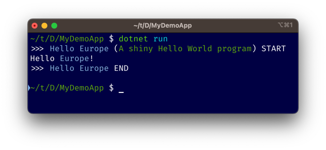
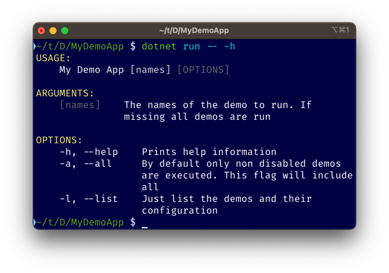
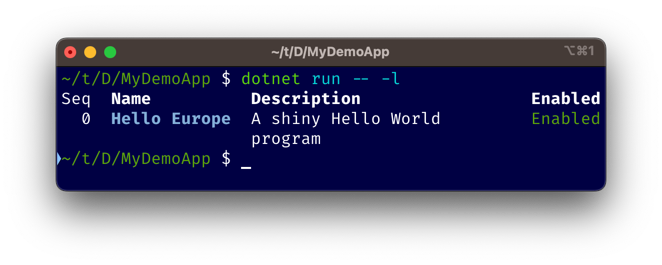

# Demonizer

[](https://github.com/bogoware/Demonizer/actions/workflows/build.yml)
[](https://github.com/bogoware/Demonizer/actions/workflows/publish.yml)

Demonizer is a .NET library designed to simplify the creation of console applications for demo and showcase purposes. With Demonizer, you can easily create console applications that look professional and impressive, even if you are not an expert in console application programming.

## Features

- **Easy-to-use API**: few lines of codes and your console app will turn into a CLI application that showcases all your demos.
- **Dependency injection**: because even a demo can evolve in something more complex to deserve a IoC.
- **spectre.console integration**: [spectre.console](https://spectreconsole.net/) is a powerful and versatile library for working with the console in .NET applications, and its integration with Demonizer makes it a great choice for creating polished and professional console demos and showcases.
  - **Rich Text Formatting**: spectre.console provides an easy-to-use API for formatting text in the console, including support for colors, styles, and fonts. 
  - **Tables**: Creating tables in the console is made easy with spectre.console. You can add columns, rows, headers, and even customize borders and styles.  
  - **Interactive Prompts**: spectre.console makes it easy to prompt the user for input in the console, including support for multiple choice questions, passwords, and more. 
  - **Animations and Progress Bars**: The package includes built-in support for animations and progress bars, making it easy to add some flair to your console applications.
  - **Figuresé**: You can also create ASCII art figures and diagrams in the console with spectre.console.
  - **And much, much more**: consult the official documentation

## Getting Started

To get started with Demonizer, simply create a project with few commands:

```
 $ dotnet new console -o MyDemoApp
 $ cd MyDemoApp
 $ dotnet add package Bogoware.Demonizer
```

then implement your first demo:

```
// MyDemo.cs
using Demonizer;
using Spectre.Console;

namespace MyDemoApp;

[Demo(Name = "Hello Europe", Description = "A shiny Hello World program", Enabled = true, Order = 0)]
public class MyDemo: IDemo
{
  public void Run(string[] args) => AnsiConsole.MarkupLine("Hello [blue]Europe[/]!");
}
```

Please note that the `DemoAttribute` is not required. By default the name of the demo match its class name, its order is -1 and is enabled, of course.

And finally turn your program to a CLI application by installing Demonzer:

``` 
// Program.cs
using Demonizer;
using MyDemoApp;

var program = new DemonizerBuilder()
	.SetAppName("My Demo App")  // Used by help
	.AddDemosFromThisAssembly() // Add all classes implementing IDemo
	.AddDemo<MyDemo>()          // Alternatively add selectively the demos you want
	.Build();

return program.Run(args);

```

Once finished you can run it from console.

**WARNING**: Dued to shell escape rules you must use '--' to signal the end of options for the `dotnet run` command and the beginning of the options to gather to the demo app under building.
This restriction doesn't apply to unrecognized subcommands of `dotnet run`.

### Screenshots

#### Default: execute all demos


#### Help switch


#### List switch


### Dependency Injection

We know, even a modest demo app can quickly required a bit of organization and DI is of help in this case.

Demonizer integrates [Microsoft Dependency Injection Extensions](https://www.nuget.org/packages/Microsoft.Extensions.DependencyInjection/) to provide this capability.

Service lifetimes are interpreted in the following way by Demnizer:
- **Singleton**: they are created the first time they're requested by ANY demo and are shared by all the demos. 
- **Scoped**: they are create the first time they're request by A SPECIFIC demo. Subsequent requests within the same demo will use the same instance. This services can be seen like *signletons at demo scope*.
- **Transient**: they are created every time they're requested.

## Contributing

If you would like to contribute to Demonizer, please fork the project and submit a pull request. We welcome contributions of all kinds, including bug fixes, feature requests, and documentation improvements.

## License

Demonizer is licensed under the [MIT License](LICENSE).